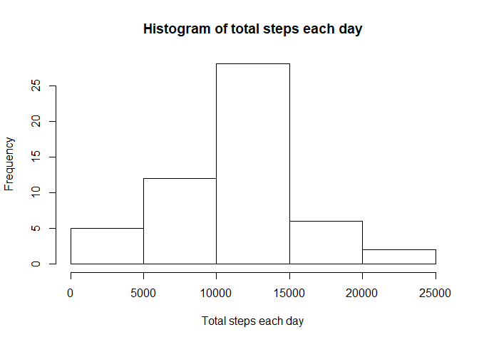
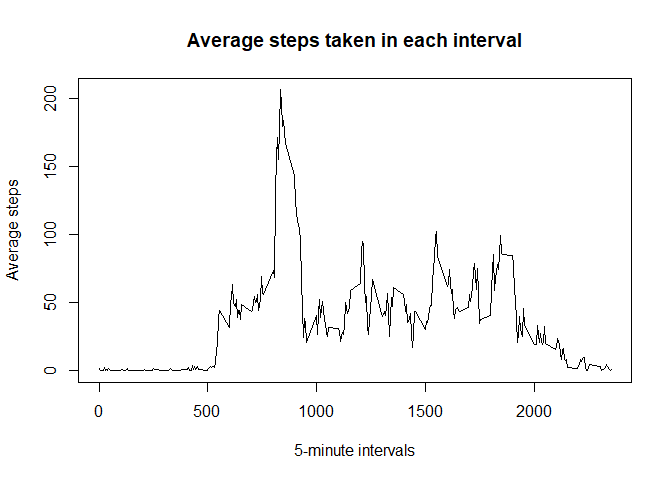
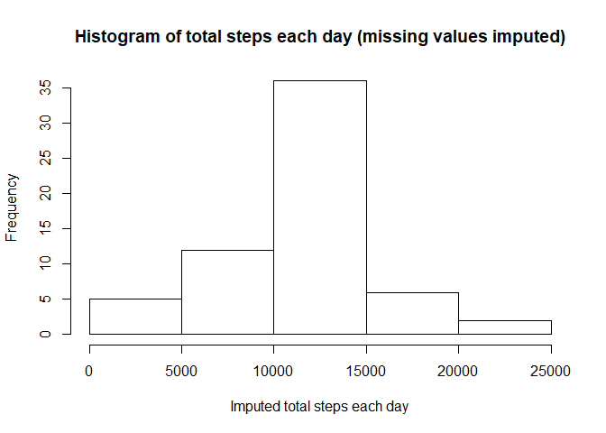

## **Loading and preprocessing the data.**

### **Load the data.**


```r
activity<-read.csv("activity.csv")
```

## **What is mean total number of steps taken per day?**

### **Calculate the total number of steps taken per day.**


```r
activity$date<-as.Date(activity$date,"%Y-%m-%d")
steps_each_day<-aggregate(steps ~ date, activity,sum)
```

### **Make a histogram of the total number of steps taken each day.**


```r
hist(steps_each_day$steps,main="Histogram of total steps each day",xlab="Total steps each day")
```

<!-- -->

### **Calculate and report the mean and median of the total number of steps taken per day.**


```r
mean_total_steps<-mean(steps_each_day$steps)
print(paste0("The mean of total steps taken per day is ",as.character(mean_total_steps)))
```

```
## [1] "The mean of total steps taken per day is 10766.1886792453"
```

```r
median_total_steps<-median(steps_each_day$steps)
print(paste0("The median of total steps taken per day is ",as.character(median_total_steps)))
```

```
## [1] "The median of total steps taken per day is 10765"
```

## **What is the average daily activity pattern?**

### **Make a time series plot (i.e. type = "l") of the 5-minute interval (x-axis) and the average number of steps taken, averaged across all days (y-axis).**


```r
average_steps_by_interval<-aggregate(steps ~ interval, activity, mean)
plot(average_steps_by_interval$interval,average_steps_by_interval$steps,type="l", xlab="5-minute intervals",ylab="Average steps", main="Average steps taken in each interval")
```

<!-- -->

### **Which 5-minute interval, on average across all the days in the dataset, contains the maximum number of steps?**


```r
max_interval<-average_steps_by_interval$interval[which.max(average_steps_by_interval$steps)]
print(paste0("The 5-minute interval that contains the maximum average number of steps is ",as.character(max_interval)))
```

```
## [1] "The 5-minute interval that contains the maximum average number of steps is 835"
```

## **Imputing missing values.**

### **Calculate and report the total number of missing values in the dataset (i.e. the total number of rows with NAs).**


```r
number_of_missing_values<-sum(is.na(activity$steps))
print(paste0("The total number of missing values in the dataset is ", as.character(number_of_missing_values)))
```

```
## [1] "The total number of missing values in the dataset is 2304"
```

### **Devise a strategy for filling in all of the missing values in the dataset.**

Below, the missing values are filled in by the mean for that 5-minute interval.

### **Create a new dataset that is equal to the original dataset but with the missing data filled in.**

```r
activity_imputed<-activity
missing_position<-which(is.na(activity_imputed$steps))
for (i in seq_along(activity_imputed$steps[missing_position])){
  interval_match<-activity_imputed$interval[missing_position[i]]
  activity_imputed$steps[missing_position][i]<-round(as.numeric(subset(average_steps_by_interval,interval==interval_match,select = "steps")))
}
```

### **Make a histogram of the total number of steps taken each day and Calculate and report the mean and median total number of steps taken per day. Do these values differ from the estimates from the first part of the assignment? What is the impact of imputing missing data on the estimates of the total daily number of steps?**

```r
steps_each_day_imputed<-aggregate(steps ~ date, activity_imputed,sum)
hist(steps_each_day_imputed$steps,main="Histogram of total steps each day (missing values imputed)",xlab="Imputed total steps each day")
```

<!-- -->

```r
mean_total_steps_imputed<-mean(steps_each_day_imputed$steps)
print(paste0("The mean of total steps taken per day is ",as.character(mean_total_steps_imputed)))
```

```
## [1] "The mean of total steps taken per day is 10765.6393442623"
```

```r
median_total_steps_imputed<-median(steps_each_day_imputed$steps)
print(paste0("The median of total steps taken per day is ",as.character(median_total_steps_imputed)))
```

```
## [1] "The median of total steps taken per day is 10762"
```

The mean total number of steps taken per day is 10765.6393442623 for the imputed dataset, smaller than the mean in the first part of the assignmentwhich was 10766.1886792453. The median total number of steps taken per day for the imputed dataset is 10762, smaller than the median in the first part of this assignment which was 10765.

Imputing the missing data made the mean and median of the total number of steps taken per day smaller.

## **Are there differences in activity patterns between weekdays and weekends?**

### **Create a new factor variable in the dataset with two levels – “weekday” and “weekend” indicating whether a given date is a weekday or weekend day.**


```r
weekend_positions<- (weekdays(activity_imputed$date)=="Saturday"|weekdays(activity_imputed$date)=="Sunday")
activity_imputed$weekdays <-0
activity_imputed$weekdays[weekend_positions]<-"weekend"
activity_imputed$weekdays[!weekend_positions]<-"weekday"
```

### **Make a panel plot containing a time series plot (i.e. type = "l") of the 5-minute interval (x-axis) and the average number of steps taken, averaged across all weekday days or weekend days (y-axis).**


```r
steps_average_by_interval_imputed<-aggregate(steps ~ interval + weekdays, activity_imputed,mean)
library(lattice)
steps_average_by_interval_imputed<-transform(steps_average_by_interval_imputed,weekdays = factor(weekdays,levels=c("weekday","weekend")))
xyplot(steps ~ interval | weekdays, data= steps_average_by_interval_imputed, layout=c(1,2),type="l",xlab="Interval",ylab="Number of steps")
```

<!-- -->

The activity pattern is clearly different between weekends and weekdays. On weekends, the steps are more even through out the day. However, on weekdays, steps are mostly distributed around morning times.
